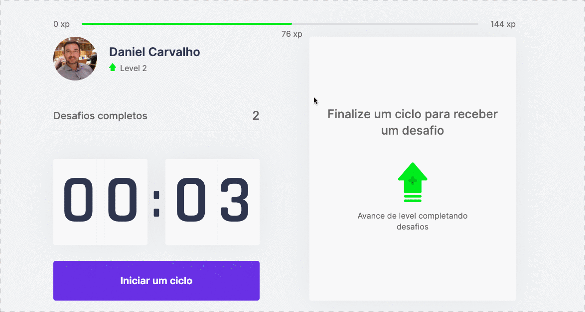

<div align="center" id="top"> 
  

  &#xa0;

  <a href="https://wemove-one.vercel.app/">Demo</a>
</div>

<h1 align="center">WeMove</h1>

<p align="center">
  

  

  

  

  <!--  -->

  <!--  -->

  <!--  -->
</p>

<h4 align="center"> 
	🚧  WeMove - Under construction...  🚧
</h4> 

<hr>

<p align="center">
  <a href="#dart-about">About</a> &#xa0; | &#xa0; 
  <a href="#sparkles-features">Features</a> &#xa0; | &#xa0;
  <a href="#rocket-technologies">Technologies</a> &#xa0; | &#xa0;
  <a href="#white_check_mark-requirements">Requirements</a> &#xa0; | &#xa0;
  <a href="#checkered_flag-starting">Starting</a> &#xa0; | &#xa0;
  <a href="#memo-license">License</a> &#xa0; | &#xa0;
  <a href="https://github.com/daniel30-07" target="_blank">Author</a>
</p>

<br>

## About

A React app for stimulating programmers and office workers to take small breaks for stretching and exercise during the day. This application uses the technique of Pomodoro and quantification of points and levels to encourage the user to improve their physical and mental health.

Developed during the 'Next Level Week #4' from [Rocketseat](https://rocketseat.com.br/).

## Features

* Start countdown;
* Start new challenge;
* Earn points;
* Level up;
* Persisting data across page reloads using Cookies

## Technologies

The following tools were used in this project:

- [React](https://pt-br.reactjs.org/)
- [Next.js](https://nextjs.org/)
- [TypeScript](https://www.typescriptlang.org/)

## Requirements

Before starting, you need to have [Git](https://git-scm.com) and [Node](https://nodejs.org/en/) installed.

## Starting

```bash
# Clone this project
$ git clone https://github.com/daniel30-07/wemove

# Access
$ cd wemove

# Install dependencies
$ yarn

# Run the project
$ yarn start

# The server will initialize in the <http://localhost:3000>
```

## License

This project is under license from MIT. For more details, see the [LICENSE](LICENSE.md) file.


Made by <a href="https://github.com/daniel30-07" target="_blank">Daniel Carvalho</a>

[](https://www.linkedin.com/in/daniel-carvalho-0a4916122/)


&#xa0;

<a href="#top">Back to top</a>
